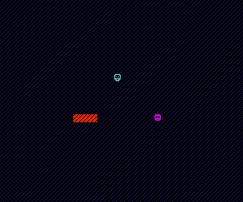
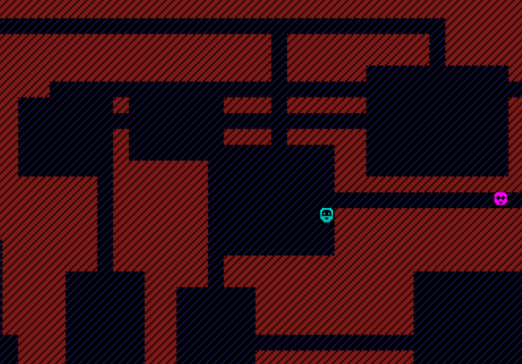
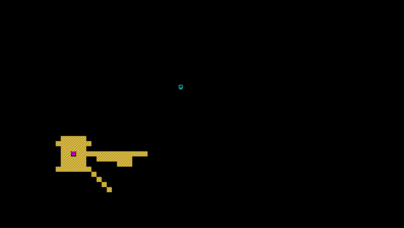
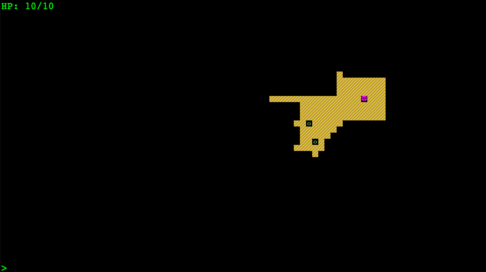
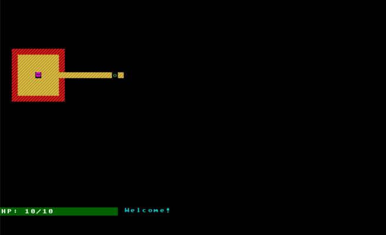

# Following the Roguelike Tutorial

This is an attempt to convert the python [Roguelike tutorial](http://rogueliketutorials.com/tutorials/tcod/) to Scala 3 using Indigo.

I'm following the spirit of the tutorials rather than the letter, since Indigo is an FP engine and the python version uses a lot of mutable constructs. Each part achieves the same goals, and where possible I've mimicked the algorithms and processes.

## Join in!

Everything is being built with [Indigo](https://indigoengine.io/) and I'm evolving a [***starter kit***](https://github.com/PurpleKingdomGames/indigo-roguelike-starterkit) that you can use.

## Completed Tutorial Parts

### Controls (so far...)

Parts|Controls
---|---
0/1 to 3|Move using Arrow keys, attack by bumping into baddies.
4 to 6|_As above, plus:_ Hit refresh in your browser to generate a new level.
7 to ?|_As above, plus:_ Hit the 'v' key to show message history and use up and down arrows to scroll.

### Table of Contents

Part|Title|Screenshot(s)|Play!
---|---|---|---
0/1|Setting Up / Drawing the ‘@’ symbol and moving it around||[Click to play!](https://davesmith00000.github.io/roguelike-tutorial/part1/)
2|The generic Entity, the render functions, and the map||[Click to play!](https://davesmith00000.github.io/roguelike-tutorial/part2/)
3|Generating a dungeon||[Click to play!](https://davesmith00000.github.io/roguelike-tutorial/part3/)
4|Field of view||[Click to play!](https://davesmith00000.github.io/roguelike-tutorial/part4/)
5|Placing enemies and kicking them (harmlessly)||[Click to play!](https://davesmith00000.github.io/roguelike-tutorial/part5/)
6|Doing (and taking) some damage||[Click to play!](https://davesmith00000.github.io/roguelike-tutorial/part6/)
7|Creating the Interface||[Click to play!](https://davesmith00000.github.io/roguelike-tutorial/part7/)
8|Items and Inventory||[Click to play!](https://davesmith00000.github.io/roguelike-tutorial/part8/)
9|||_Coming soon..._
10|||_Coming soon..._
11|||_Coming soon..._
12|||_Coming soon..._
13|||_Coming soon..._
