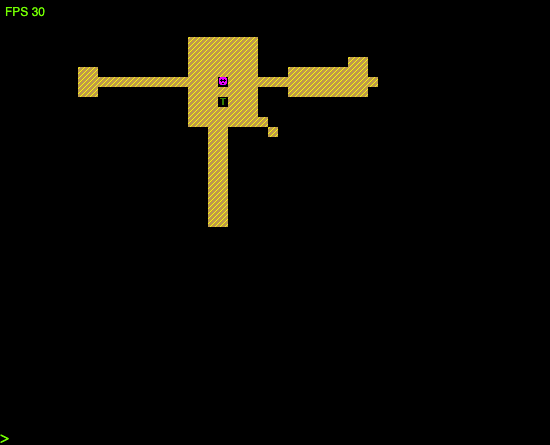
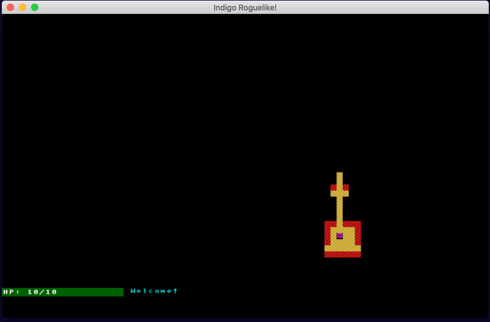

# Following the Roguelike Tutorial

This is an attempt to convert the python [Roguelike tutorial](http://rogueliketutorials.com/tutorials/tcod/) to Scala 3 using Indigo.

I'm following the spirit of the tutorials rather than the letter, since Indigo is an FP engine and the python version uses a lot of mutable constructs. Each part achieves the same goals, and where possible I've mimicked the algorithms and processes.

## This is not a game

There are 13 parts to the tutorial (2020 version), all of which are presented below.

The final result of all this work is not a very good game. It isn't well balanced. It has no ending. The mechanics are limited. The code brilliantly well written - by the end I was just pleased to be finished!

All I've done it try and produce each section reasonably faithfully, but even there I've occasionally just made it up as I went along.

What this _might_ be, is the start of something. There are obvious improvements that could be made like giving the code a good refactoring, improving the rendering speed and reducing the system requirements. But even in it's current state.. it has promise, because... it's fun!

Maybe next year I'll start from where I left off. Or maybe you will? :-)

## Join in!

Everything is being built with [Indigo](https://indigoengine.io/) and I'm evolving a [***starter kit***](https://github.com/PurpleKingdomGames/indigo-roguelike-starterkit) that you can use.

## Completed Tutorial Parts

### Accumulated Controls

Parts|Controls
---|---
0/1 to 3|Move using Arrow keys, attack by bumping into baddies.
4 to 6|_As above, plus:_ Hit refresh in your browser to generate a new level.
7|_As above, plus:_ Hit the 'v' key to show message history and use up and down arrows to scroll.
8|_As above, plus:_ Hit the 'i' key to show inventory and 'd' to show the "drop" menu. Use up and down arrows to scroll in both, the a-z keys to choose an item to consume/drop, and shift|ctrl|alt|esc to close any windows.
9|_As above, plus:_ Hit the "/" key to enter "look around" mode and "/" or "Esc" to leave. When using a confusion or fireball scroll, you will enter look around mode to find a target, press "Enter" to select it.
10|_As above, plus:_ Hit "n" to start a new game or "c" to continue a saved game on the main menu. In game, hit "q" to bring up the quit menu, choose / press "1", "2", or "3" to save your game, save and quit, or quit to main menu respectively. When you die, you can still hit "q" to bring up the menu and return to the main menu.
11 to 13|_As above, plus:_ Hit "c" to show/hide the character stats window, when standing on stairs, press "." to go down a level. In the level up menu, choose the stat to increase with 1, 2, or 3 keys.

### Table of Contents

Part|Title|Screenshot(s)|Play!
---|---|---|---
0/1|Setting Up / Drawing the ‘@’ symbol and moving it around||[Click to play!](https://davesmith00000.github.io/roguelike-tutorial/part1/)
2|The generic Entity, the render functions, and the map||[Click to play!](https://davesmith00000.github.io/roguelike-tutorial/part2/)
3|Generating a dungeon||[Click to play!](https://davesmith00000.github.io/roguelike-tutorial/part3/)
4|Field of view||[Click to play!](https://davesmith00000.github.io/roguelike-tutorial/part4/)
5|Placing enemies and kicking them (harmlessly)||[Click to play!](https://davesmith00000.github.io/roguelike-tutorial/part5/)
6|Doing (and taking) some damage||[Click to play!](https://davesmith00000.github.io/roguelike-tutorial/part6/)
7|Creating the Interface||[Click to play!](https://davesmith00000.github.io/roguelike-tutorial/part7/)
8|Items and Inventory||[Click to play!](https://davesmith00000.github.io/roguelike-tutorial/part8/)
9|Ranged Scrolls and Targeting||[Click to play!](https://davesmith00000.github.io/roguelike-tutorial/part9/)
10|Saving and loading||[Click to play!](https://davesmith00000.github.io/roguelike-tutorial/part10/)
11|Delving into the Dungeon||[Click to play!](https://davesmith00000.github.io/roguelike-tutorial/part11/)
12|Increasing Difficulty||[Click to play!](https://davesmith00000.github.io/roguelike-tutorial/part12/)
13|Gearing up||[Click to play!](https://davesmith00000.github.io/roguelike-tutorial/part13/)
