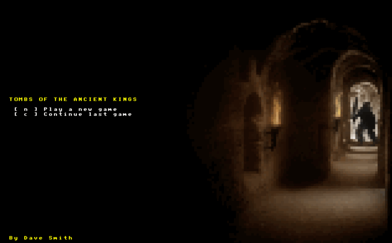

# Part 10 - Saving and loading

[Tutorial Part 10](http://rogueliketutorials.com/tutorials/tcod/v2/part-10/)

The Saving and Loading chapter is very hard to skim to understand what is supposed to be going on, so I'm going to make it up, based on the screenshot of the title screen:

1. On game start, we check for a save game on a loading screen.
2. We then show the title screen. If there is a save game, we can allow people to load, otherwise they hit "new game".
3. Once they in the game (new or loaded), if they hit "q" we'll ask if they'd like to save, save and quit to title, or quit to title. Hitting "q" again will close the window.
4. When you die, you are given a way back to the title screen.
5. From the title screen, hitting new generates a new dungeon and you start again.
